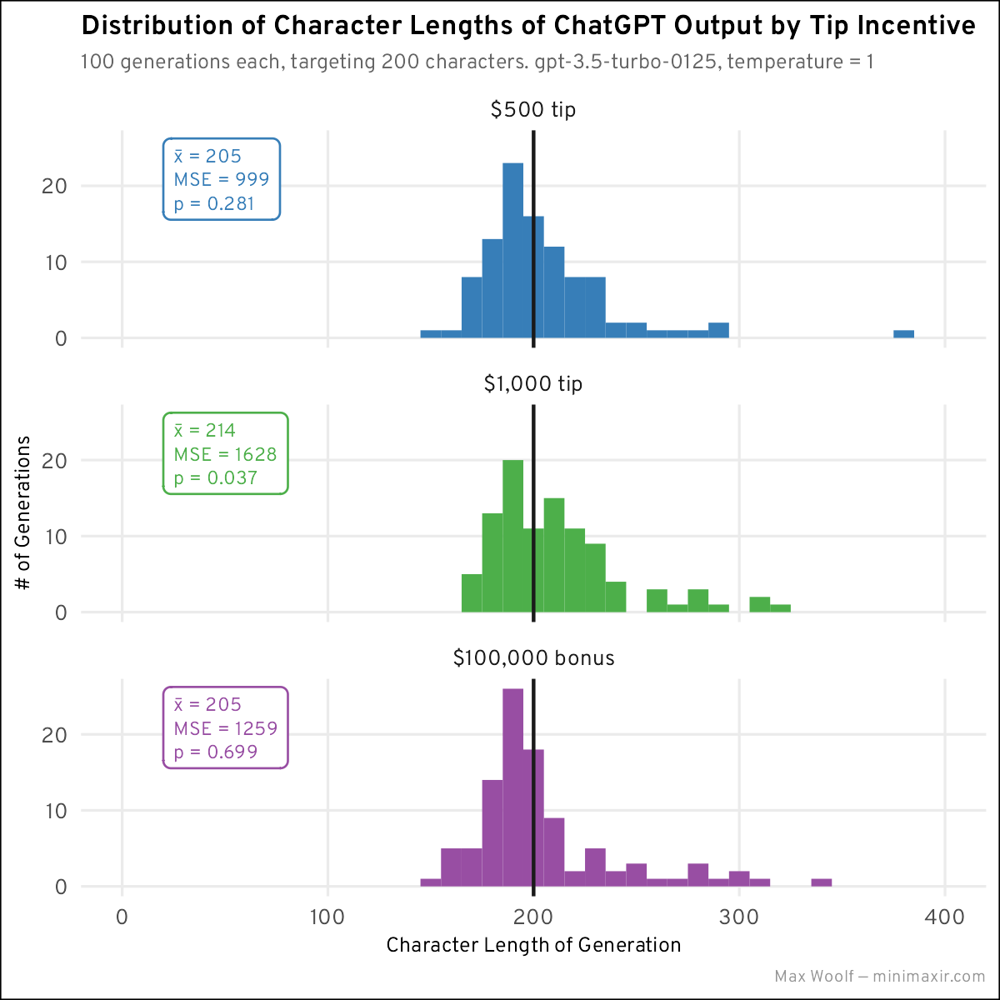

```{r}
library(tidyverse)
library(scales)

caption <- "Max Woolf — minimaxir.com"

sessionInfo()
```
```{r}
theme_set(theme_minimal(base_size = 8, base_family = "Overpass") +
  theme(
    plot.title = element_text(size = 8, face = "bold"),
    plot.subtitle = element_text(color = "#666666", size = 6),
    axis.title.x = element_text(size = 6),
    axis.title.y = element_text(size = 6),
    plot.caption = element_text(size = 5, color = "#969696"),
    plot.background = element_rect(fill = "#FFFFFF"),
    legend.title = element_text(size = 8),
    legend.key.width = unit(0.25, unit = "cm"),
    panel.grid.minor = element_blank()
  ))
```

```{r}
df <- read_csv("tip_trials.csv")
df %>% head()
```

```{r}
plot <- ggplot(df, aes(output_len, fill = label)) +
  geom_histogram(binwidth = 10) +
  scale_x_continuous(limits = c(0, 400)) +
  geom_vline(xintercept = 200, color = "#1a1a1a") +
  scale_fill_brewer(palette = "Set1", guide = "none") +
  labs(
    title = "Distribution of Character Lengths of ChatGPT Output by Tip Incentive",
    subtitle = "100 generations each, targeting 200 characters. gpt-3.5-turbo-0125, temperature = 1",
    x = "Character Length of Generation", y = "# of Generations",
    caption = caption
  ) +
  facet_wrap(~label, nrow = 2)

ggsave("tips_hist_pos.png", plot, width = 4, height = 3)
```

